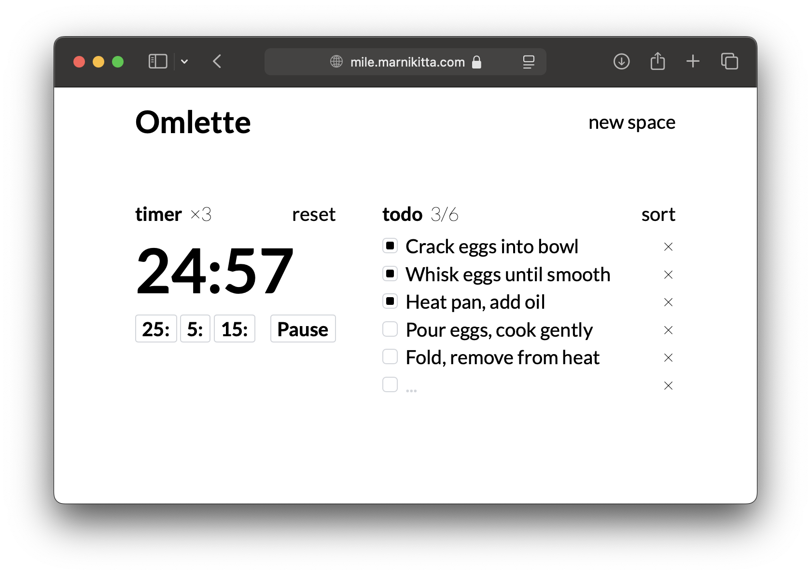

# Last mile

Try it out here: [mile.marnikitta.com](https://mile.marnikitta.com)



The “Last mile” is your space for focusing on and progressing through a single task. Each space includes a
plain to-do list and a timer.
This is not a replacement for a full-fledged task tracker. It’s a tool for tackling one bite-sized task at
a time.

Spaces are ment to be temporary. Once you’re done with a task, delete the space and move on.

All data is stored locally in your browser’s storage, ensuring simplicity and privacy.

It is a shameless copy of a [daily.place](https://daily.place) app.

#### Getting started

The app doesn't require any build steps. Just open the index.html file in your browser.

```bash
open index.html
```


